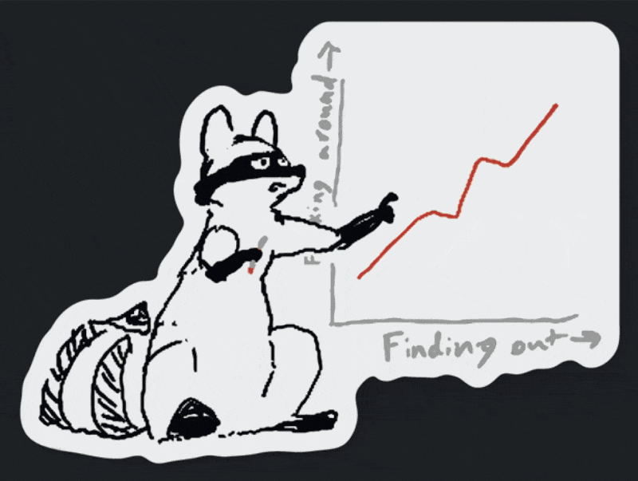

# Minecraftize

Minecraftize is a Python project that converts regular images into Minecraft-style images using block textures. It analyzes each pixel of the input image and replaces it with the most similar Minecraft block texture.

## Features

- Convert any image into a Minecraft-style image
- Multithreaded processing for faster conversion
- Command-line interface for easy usage

## Examples

You can go to [examples](examples/) directory to see before and after images of some of [Hack Club's stickers](https://hackclub.com/stickers/). You will need to zoom in a lot to see the actual blocks!



## Requirements

- Python 3.6+
- Pillow (PIL Fork)

## Installation

1. Clone this repository:

   ```
   git clone https://github.com/artem4852/minecraftize.git
   cd minecraftize
   ```

2. Install the required packages:

   ```
   pip install pillow
   ```

3. Set up the Minecraft textures (see "Texture Setup" section below)

## Usage (Prompt version)

1. Run the script with the following command:

   ```
   python main_v2.py
   ```

2. When prompted, enter the path to the image you want to convert.

3. Optionally, specify the number of threads to use for processing (default is 10).

4. The converted image will be saved in the same directory as the original image with "\_converted" appended to the filename.

## Usage (Args version)

1. Run the script with the following command

   ```
   python main_v1.py -p <path_to_image> -t <number_of_threads (optional)>
   ```

2. The converted image will be saved in the same directory as the original image with "\_converted" appended to the filename.

## Texture Setup

Due to copyright restrictions, we cannot distribute Minecraft textures. To use this project, you'll need to extract the textures from your own copy of Minecraft. Here's how:

1. Locate your Minecraft installation folder:

   - Windows: `%APPDATA%\.minecraft`
   - macOS: `~/Library/Application Support/minecraft`
   - Linux: `~/.minecraft`

2. Find the version folder you want to use (e.g., `versions/1.16.5`)

3. Open the `.jar` file for that version (you may need to rename it to `.zip` and then extract it)

4. Navigate to `assets/minecraft/textures/block` in the extracted files

5. Copy all the `.png` files from this folder into a `textures` folder in your project directory

6. Run `load_avg_values.py` to generate the `avg_values.json` file:
   ```
   python load_avg_values.py
   ```

## Contributing

Contributions are welcome! Please feel free to submit a Pull Request.

## License

This project is open source and available under the MIT License.

## Disclaimer

This project is not affiliated with Mojang or Microsoft.
